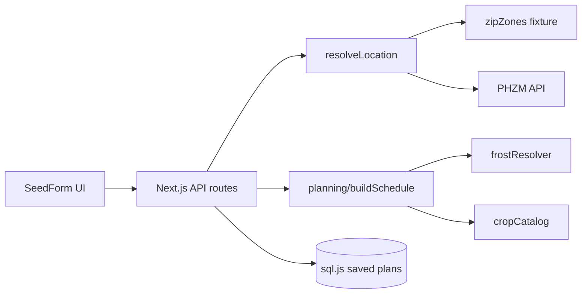

# Seed Starter

Frost-aware garden planning for US ZIP codes. Pick crops and a risk profile, get a full planting timeline (sow, harden, transplant, harvest), and export CSV, calendar, or print-friendly schedules.

## Features

- 11 crops, 23 varieties with lifecycle rules
- Risk profiles: conservative / balanced / aggressive
- Frost fallback chain: NOAA station fixture → regional fixture → zone estimate
- Offline USDA ZIP → zone fixture with PHZM API fallback
- Saved plans (local SQLite via sql.js)
- CSV, iCalendar, and print exports

## Architecture



Domain logic lives in `src/planning/` (framework-free). API routes validate input, resolve location, delegate to `buildSchedule()`, and serialize results. See [docs/api.md](docs/api.md) and [docs/adrs/001-planning-boundary.md](docs/adrs/001-planning-boundary.md).

## Setup

```bash
npm install
npm run dev
```

Open [http://localhost:3000](http://localhost:3000).

## Scripts

| Command | Description |
|---------|-------------|
| `npm run dev` | Dev server |
| `npm run build` | Production build |
| `npm run start` | Serve production build |
| `npm run lint` | ESLint |
| `npm test` | Unit tests |
| `npm run test:coverage` | Unit tests + coverage gates |
| `npm run test:e2e` | Playwright browser tests |
| `npm run check` | Data quality, lint, types, coverage, build |

## API

See [docs/api.md](docs/api.md).

## Deploy

Works on [Vercel](https://vercel.com) or any Node host supporting Next.js 15. Run `npm run build` before `npm run start`.
