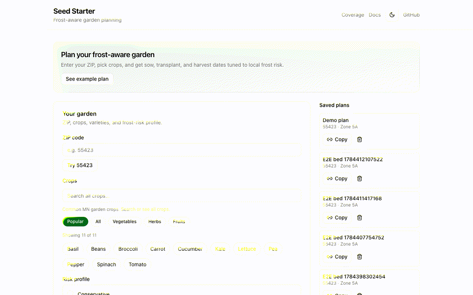
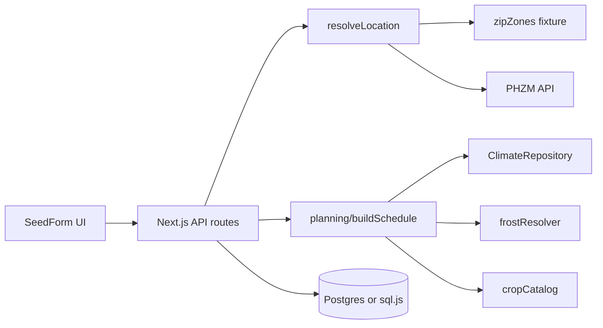

# Seed Starter

Frost-aware garden planning for US ZIP codes. Pick crops and a risk profile, get a full planting timeline (sow, harden, transplant, harvest), and export CSV, calendar, or print-friendly schedules.

**[Live demo](https://seed-starter.vercel.app)** · [API docs](docs/api.md) · [Data sources](docs/data-sources.md)



## Features

- 11 crops, 23 varieties with lifecycle rules
- Risk profiles: conservative / balanced / aggressive (frost p90 / p50 / p10)
- Climate data: NOAA GHCN nearest-station frost percentiles for US ZCTAs
- Frost fallback chain: climate → station → regional → zone
- USDA ZIP → zone via PHZM API + offline fixture
- Saved plans (Postgres on Vercel, sql.js locally)
- CSV, iCalendar, and print exports

## Architecture



Domain logic lives in `src/planning/` (framework-free). See [docs/adrs/001-planning-boundary.md](docs/adrs/001-planning-boundary.md).

## Setup

```bash
pnpm install
cp .env.example .env.local   # optional: DATABASE_URL for Postgres
pnpm run dev
```

Open [http://localhost:3000](http://localhost:3000).

## Scripts

| Command | Description |
|---------|-------------|
| `pnpm run dev` | Dev server |
| `pnpm run build` | Production build |
| `pnpm run check` | Data quality, lint, types, coverage, build |
| `pnpm test` | Unit tests |
| `pnpm run test:e2e` | Playwright browser tests |
| `pnpm run etl:climate` | Build `data/zipClimate.json` from GHCN |
| `pnpm run capture:demo` | Record `docs/demo.gif` (needs running app + ffmpeg) |

## Deploy (Vercel)

1. Import repo at [vercel.com/new](https://vercel.com/new)
2. Add **Postgres** (Neon) storage → sets `DATABASE_URL` automatically
3. Deploy — `vercel.json` configures pnpm build

Without `DATABASE_URL`, schedules work but saved plans use ephemeral local sql.js (not suitable for production).

```bash
npx vercel --prod
```

## UI

- Variety picker, risk compare, saved plans with share links (`/plans?id=…`)
- Task timeline, frost provenance badge, climate version + percentile tooltip
- Print / CSV / ICS export, dark mode, mobile sticky calculate bar

## API

See [docs/api.md](docs/api.md).
