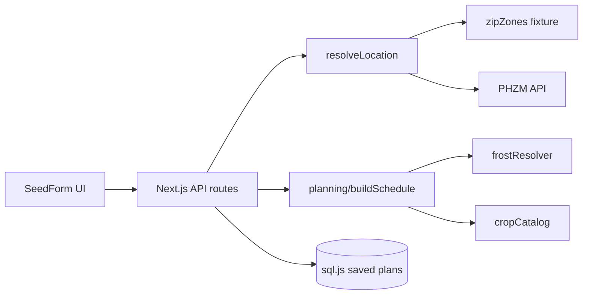

# Seed Starter

Frost-aware garden planning for US ZIP codes. Pick crops and a risk profile, get a full planting timeline (sow, harden, transplant, harvest), and export CSV, calendar, or print-friendly schedules.

## Features

- 11 crops, 23 varieties with lifecycle rules
- Risk profiles: conservative / balanced / aggressive
- Frost fallback chain: NOAA station fixture → regional fixture → zone estimate
- Offline USDA ZIP → zone fixture with PHZM API fallback
- Saved plans (local SQLite via sql.js)
- CSV, iCalendar, and print exports

## Architecture



Domain logic lives in `src/planning/` (framework-free). API routes validate input, resolve location, delegate to `buildSchedule()`, and serialize results. See [docs/api.md](docs/api.md) and [docs/adrs/001-planning-boundary.md](docs/adrs/001-planning-boundary.md).

## Setup

```bash
pnpm install
pnpm run dev
```

Open [http://localhost:3000](http://localhost:3000).

## UI

- Variety picker per crop, risk profile compare, saved plans sidebar
- Grouped task timeline with icons, frost provenance badge, skeleton loading
- Print / CSV / ICS export, dark mode, mobile sticky calculate bar
- Shareable read-only plan view: `/plans?id={planId}`

### UX decisions

- **Server-owned schedules** — the UI never computes dates; it displays API results so frost logic stays testable and consistent.
- **Progressive disclosure** — compare profiles and varieties are optional without leaving the main flow.
- **Print-first results** — timeline layout works on paper for use in the garden.

## Scripts

| Command | Description |
|---------|-------------|
| `pnpm run dev` | Dev server |
| `pnpm run build` | Production build |
| `pnpm run start` | Serve production build |
| `pnpm run lint` | ESLint |
| `pnpm test` | Unit tests |
| `pnpm run test:coverage` | Unit tests + coverage gates |
| `pnpm run test:e2e` | Playwright browser tests |
| `pnpm run check` | Data quality, lint, types, coverage, build |

## API

See [docs/api.md](docs/api.md).

## Deploy

Works on [Vercel](https://vercel.com) or any Node host supporting Next.js 15. Run `pnpm run build` before `pnpm run start`.
