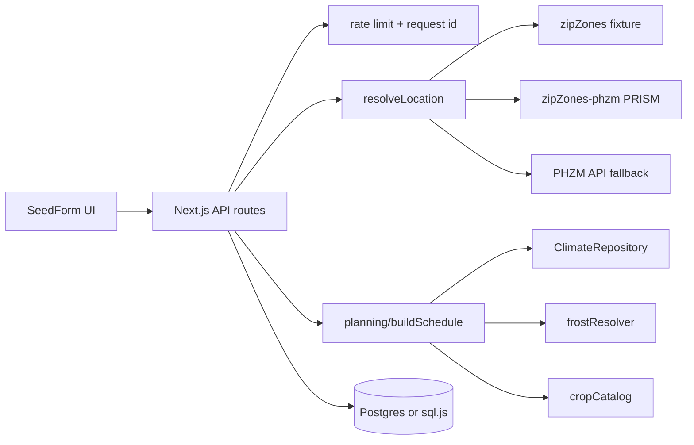

# Seed Starter

Frost-aware garden planning for US ZIP codes. Pick crops and a risk profile, get a full planting timeline (sow, harden, transplant, harvest), and export CSV, calendar, or print-friendly schedules.

**[Live demo](https://seed-starter.vercel.app)** · [Coverage](https://seed-starter.vercel.app/coverage) · [API docs](https://seed-starter.vercel.app/docs) · [Data sources](docs/data-sources.md)


## Features

- 90 crops, 2000 varieties from Johnny's, High Mowing, Territorial, and Fedco
- Crop picker: Popular / All / Vegetables / Herbs / Fruits + search
- Risk profiles: conservative / balanced / aggressive (frost p90 / p50 / p10)
- Climate data: NOAA GHCN nearest-station frost percentiles for ~33k US ZCTAs
- Frost fallback chain: climate → station → regional → zone
- Station-distance confidence (high / medium / low); outliers >200 km rejected
- USDA ZIP → zone via PRISM 2023 + PHZM API fallback
- Saved plans (Postgres on Vercel, sql.js locally) with climate snapshot + stale/diff UI
- Optional owner-cookie auth (`AUTH_SECRET`)
- Rate limits, request IDs, structured JSON logs, optional Sentry
- OpenAPI 3 at `/api/openapi` · Swagger UI at `/docs`
- CSV, iCalendar, and print exports

## Architecture



Domain logic lives in `src/planning/` (framework-free). ADRs:

| ADR | Topic |
|-----|--------|
| [001](docs/adrs/001-planning-boundary.md) | Planning boundary |
| [002](docs/adrs/002-persistence.md) | sql.js vs Postgres |
| [003](docs/adrs/003-climate-nearest-station.md) | GHCN nearest-station model |
| [004](docs/adrs/004-frost-first-mvp.md) | Frost-first scope |
| [005](docs/adrs/005-owner-cookie-auth.md) | Owner cookie auth |
| [Threat model](docs/threat-model.md) | Cookie, share links, rate limits |

Next builds: [plans](docs/plans/) — fall season, summer season, variety timing.

### Failure modes

| Failure | Behavior |
|---------|----------|
| ZIP not in climate table | Station → regional → zone frost |
| Station >200 km | Climate tier rejected; same fallback |
| PHZM API down | Bundled PRISM table still resolves most ZIPs |
| No `DATABASE_URL` on Vercel | Schedules work; saved plans not durable across instances |
| Rate limit exceeded | `429` + `Retry-After` |
| Climate data refresh | Saved plans flag stale + show last-frost diff |

## Setup

```bash
pnpm install
cp .env.example .env.local   # DATABASE_URL, AUTH_SECRET, SENTRY_DSN optional
pnpm run dev
```

Open [http://localhost:3000](http://localhost:3000).

## Scripts

| Command | Description |
|---------|-------------|
| `pnpm run dev` | Dev server |
| `pnpm run build` | Production build |
| `pnpm run check` | Data quality, drift, golden ZIPs, lint, types, coverage, build |
| `pnpm test` | Unit tests |
| `pnpm run test:e2e` | Playwright browser tests |
| `pnpm run smoke` | Hit health + schedule + openapi (`SMOKE_URL`) |
| `pnpm run smoke:prod` | Strict prod smoke (`postgres` + `owner-cookie`) |
| `pnpm run test:postgres` | Saved-plan tests against `DATABASE_URL` |
| `pnpm run audit` | Production dependency audit (high+) |
| `pnpm run etl:climate` | Build `data/zipClimate.json` from GHCN |
| `pnpm run etl:phzm` | Refresh PRISM zone table |
| `pnpm run etl:catalog` | Scrape seed catalogs → `data/catalog/crops.json` |
| `pnpm run check:catalog` | Validate catalog JSON (junk crops, counts) |
| `pnpm run capture:demo` | Record `docs/demo.gif` |

## Deploy (Vercel)

Checklist:

1. GitHub repo connected (Settings → Git) — deploys on push to `main`
2. **Neon Postgres** storage → `DATABASE_URL`
3. Set `AUTH_SECRET` (random 32+ bytes) for owner-scoped saved plans
4. Optional: `SENTRY_DSN`
5. Confirm [health](https://seed-starter.vercel.app/api/health) `commit` matches latest SHA and `persistence` is `postgres`

```bash
npx vercel --prod
pnpm run smoke   # SMOKE_URL=https://seed-starter.vercel.app
```

## UI

- Crop picker with category tabs, search, and pagination
- Variety picker, risk compare, saved plans with share links (`/plans?id=…`)
- Task timeline, frost provenance + confidence badges, climate version tooltips
- Stale-plan warning with last-frost recompute diff
- Coverage dashboard at `/coverage`
- Print / CSV / ICS export, dark mode, mobile sticky calculate bar

## API

Interactive: [/docs](https://seed-starter.vercel.app/docs) · Spec: [/api/openapi](https://seed-starter.vercel.app/api/openapi) · Notes: [docs/api.md](docs/api.md).
